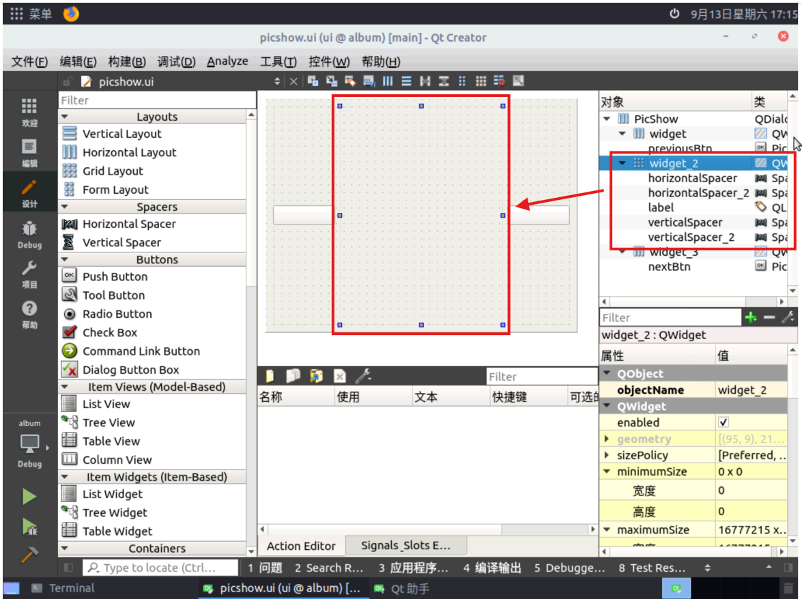
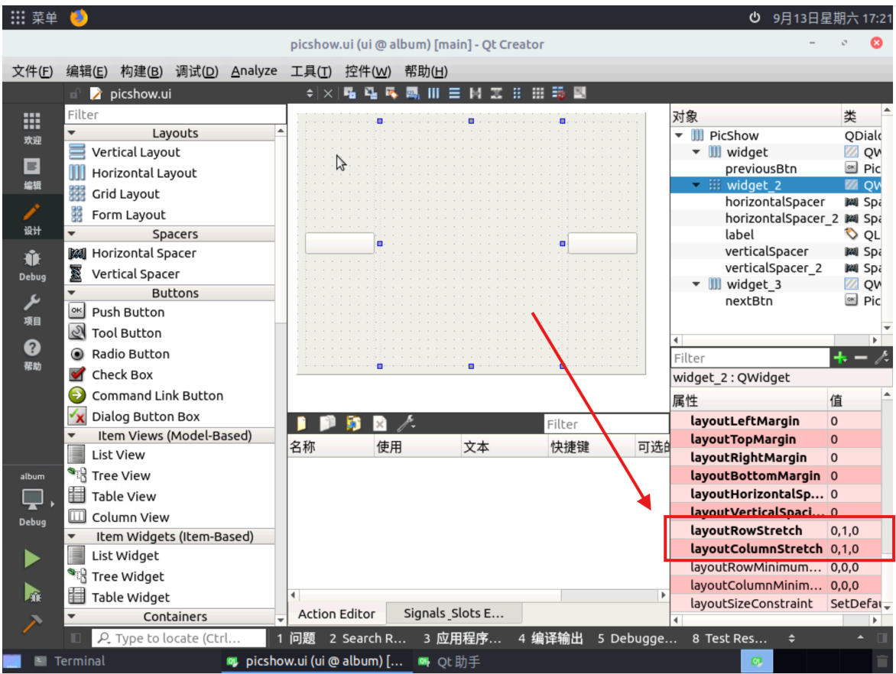
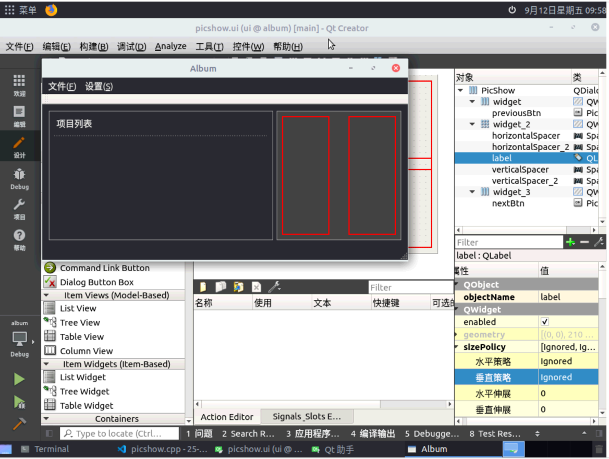
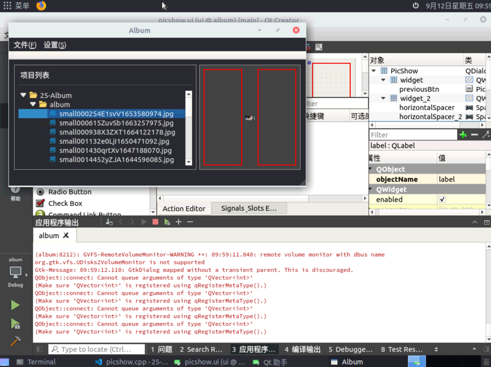
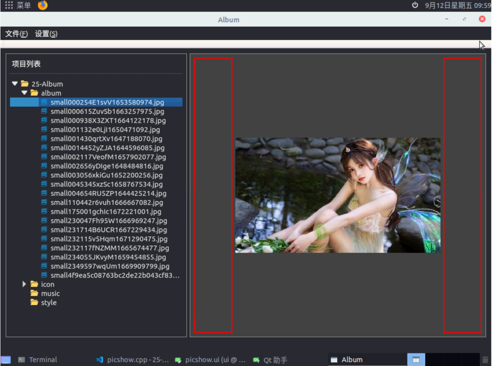
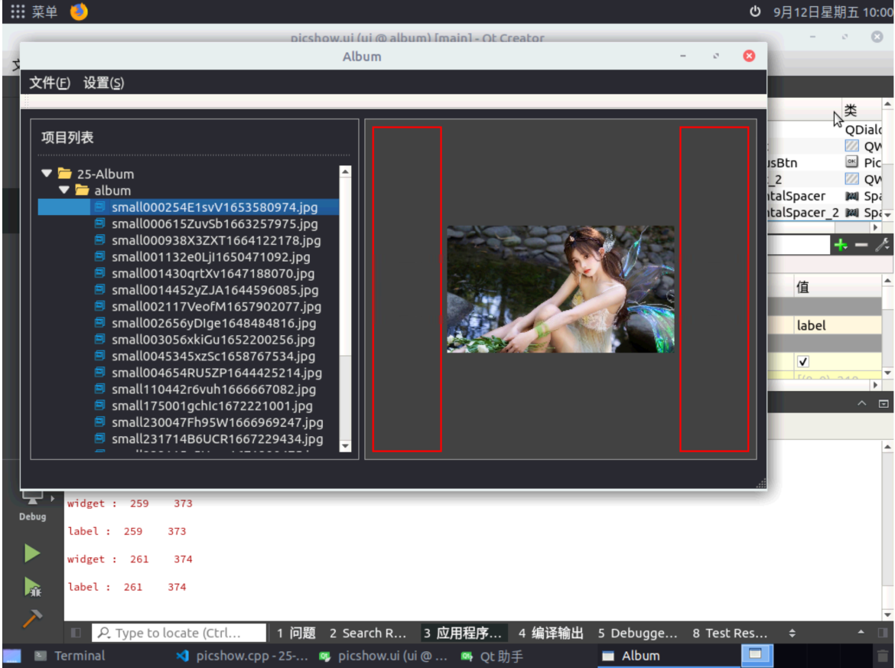

# album
&nbsp;&nbsp;&nbsp;&nbsp;这是一个跟随恋恋风辰([博客地址](https://llfc.club/home)、[B站地址](https://space.bilibili.com/271469206))学习用Qt写一个相册的项目。目前完成了album内相册的创建和打开，图片的展示和切换，剩余未完成的是以幻灯片形式播放图片的相关功能。
## 开发环境
+ 系统版本：Ubuntu 18.04.4 LTS(后转22.04)
+ Qt版本：Qt 5.9.5(后5.15.3)、Qt Creator 4.5.2(后6.0.2)
## 亮点
### 线程分离
&nbsp;&nbsp;&nbsp;&nbsp;继承`QThread`重写了`run()`方法，在加载文件夹时避免了主线程的阻塞。具体见`ProTreeThread`和`OpenTreeThread`。
### 针对Ubuntu的优化
&nbsp;&nbsp;&nbsp;&nbsp;开发过程中发现QFileDialog的`setFileMode(QFileDialog::Directory)`和`setOption(QFileDialog::ShowDirsOnly)`组合并没有达到期望的效果，我期望的是向导页浏览本地目录时只展示文件夹不展示文件，而这个模式在Ubuntu下还是会显示文件，官方文档也说了 `The name of a directory. Both files and directories are displayed. However, the native Windows file dialog does not support displaying files in the directory chooser`。针对该情况做了如下优化：

```c++
QFileDialog file_dialog;
file_dialog.setFileMode(QFileDialog::Directory);
// 仅在Linux上强制使用Qt对话框
#if defined(Q_OS_LINUX) && !defined(Q_OS_ANDROID)
// Linux下默认的对话框模式设置QFileDialog::ShowDirsOnly不生效
    file_dialog.setOption(QFileDialog::DontUseNativeDialog, true);
#endif
file_dialog.setOption(QFileDialog::ShowDirsOnly);
```


### 图片动态变化大小
&nbsp;&nbsp;&nbsp;&nbsp;原代码在PicShow相关的布局和尺寸的获取有些问题，导致即使重写了resizeevent()方法，初次显示图片时图片会把已经全屏的主界面撑大，同时在拉伸主界面时图片所在的布局只能放大不能缩小。对此我做了一些改动。
- 新建QWidget作为label和四个弹簧的父widget


- 设置布局gridlayout
  - 对PicShow的三个子widget从左往右重命名为widget, widget_2, widget_3。widget_2布局设置为QGridLayout，修改布局的拉伸因子stretch，数字越大优先级越高，行为0, 1, 0，列为0, 1, 0，如图


- 修改子label的尺寸调整策略
  - 创建时这五个原件默认sizepolicy都是expanding，这会出现图片能放大但不能缩小的问题，我查到的解决方式是把label的sizepolicy修改为ignored。最终效果如下(为凸显效果，对左widget和右widget_3添加了临时的边框)：









### 图片轮播


## 杂记

功能

`QGraphicsOpacityEffect`提供透明度相关的设置，它提供`setOpacity()`功能设置透明度，透明度在0-1之间，0是完全透明，1是完全不透明。    需要用到`QWidget::setGraphicsEffect(QGraphicsEffect *effect)`，我看qt的文档把前面透明度的实例称为effect，把`QWidget`的实例称为widget，用这个方法把effect装入widget，这个安装会把widget之前安装的effect删除（不知道原先的effect是否还能被复用，还是其占用的内存已经被删除了），同时如果要安装的这个effect已经被别的widget装了的话，会卸下来给这个widget装上。    因此我写两个`QPushButton`，给两个button设置透明度，需要创建两个透明度实例。


互引用，两个头文件`a.h`和`b.h`互相引用，解决方式是前向声明，假设`a.h`内是类A的声明，`b.h`内是类B的声明，在`a.h`内用`class B;`前向声明类B，在`a.cpp`内引用`b.h`；`b.h`和`b.cpp`内同理。    补充：适用于只需要指针、引用和返回值类型时。 使用`#pragma once`防止重复包含。


目前，关于slideShowDlg界面的qss配置有问题，四个qpushbutton的效果有点奇怪，并且我发现，closeBtn的定义，qss文件内其他的ui文件也有同名的，不知道是否是这种情况导致的bug。    qss在assistant里用Qt  Style Sheets搜索。    后来证明整个按钮的格式就是要去掉的，load的图片才是本体。


新的问题来了，什么是双缓冲绘图？

## 已知bug

+ `ProTreeItem`类在特定情况下无法正确找到pre和next节点，进而导致`PicAnimationWid`播放项目内图片时播放的图片不全

​	特定的目录结构如下：

```powershell
itemPro项目(ProTreeItem, type == TreeItemPro)
├── itemPic_1 (pre_item ==  , next_item == itemPic_2)
├── itemPic_2 (pre_item == itemPic_1, next_item == itemPic_4)
├── itemDir_3 (pre_item ==  , next_item ==  )
│   ├── itemPic_3_1 (pre_item == itemPic_2, next_item == itemPic_3_2)
│   └── itemPic_3_2 (pre_item == itemPic_3_1, next_item ==  )
├── itemPic_4 (pre_item == itemPic_2, next_item == itemPic_4)
└── itemPic_5 (pre_item == itemPic_4, next_item ==  )
```

​	每一个项目（`ProTreeWidget`实例）都是由`OpenTreeThread`或`ProTreeThread`生成的，生成时按名称排序。如果是上面的文件目录，就会出现`itemPic_2`的next_item跳过`itemDir_3`目录下的图片指向`itemPic_4`，`itemPic_3_1`的pre_item指向`itemPic_2`。进而导致图片轮播时的功能异常。

​	而如果`itemPic_4`和`itemPic_5`不存在，则`itemPic_2`的next_item会指向`itemPic_3_1`。

​	**解决办法（未实施）**：需要修改两个项目生成相关线程的逻辑，把目录item也加入item的连接；同时修改图片轮播的逻辑，发现遍历到目录就继续向后寻找，直到发现空指针。    优先实现完整功能再考虑解决该问题。


https://www.bilibili.com/video/BV1FM411x7dY          视频8
