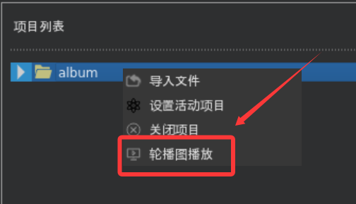
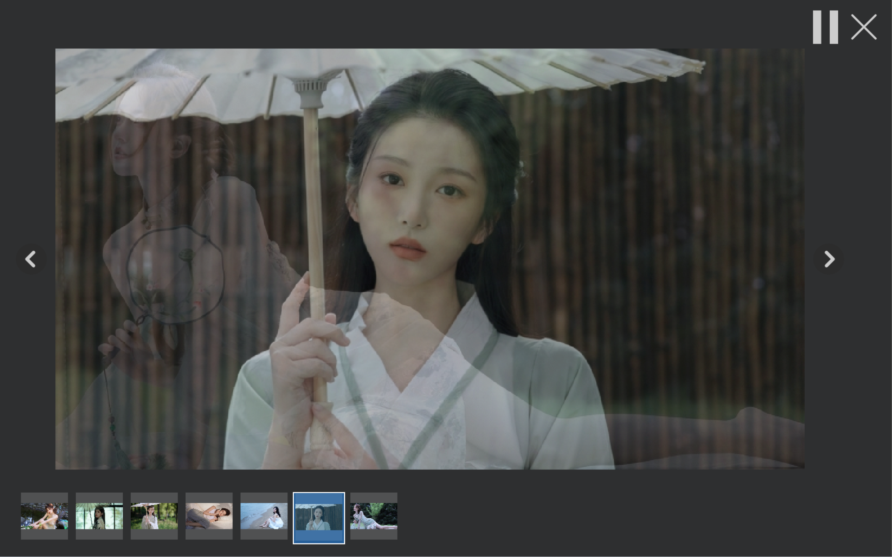

# album
&emsp;&emsp;这是一个跟随恋恋风辰([博客地址](https://llfc.club/home)、[B站地址](https://space.bilibili.com/271469206))学习用Qt写一个相册的项目。视指定目录为一个项目，通过导入指定目录或新建来生成一个项目，提供图片的查看、前后切换、播放和背景音乐播放等功能。

## 项目概述

&emsp;&emsp;涉及的技能点：

+ Qt框架核心组件的使用：`QWidget`、`QTreeWidget`、`QTreeWidgetItem`、`QListWidget`、`QThread`和信号槽机制等；
+ C++在GUI中的实际应用；
+ UI线程与工作线程分离：主线程专注渲染，工作线程负责目录下文件的导入；
+ 针对高性能图形渲染需求，重写`QWidget::paintEvent()`并实现双缓冲绘图，避免了直接绘制到屏幕导致的闪烁；
+ 根据具体需要对Qt提供的基类定制功能；

## 项目结构

```powershell
album/
├── album.pro     #Qt工程文件
├── inc/
│   ├── const.h   #常量
│   └── *.h       #头文件
├── src/          #源代码
├── icon/         #图标文件
├── ui/           #界面相关类
├── style/
│   └── style.qss #样式表
├── album/        #演示用图片
├── music/        #演示用音乐
├── assets/       #README用图片
└── README.md     #本文档
```

## 快速开始

### 开发环境
+ 系统版本：Ubuntu 18.04.4 LTS(后转22.04)
+ Qt版本：Qt 5.9.5(后5.15.3)、Qt Creator 4.5.2(后6.0.2)

+ 环境配置
  + 开始环境是Ubuntu18.04，使用`sudo apt install qt5default`即可安装一套默认的、完整的Qt5桌面开发环境，版本如上。
  + 后面换成WSL，环境是Ubuntu22.04，qt5default被官方弃用，找不到它。使用`sudo apt install qtbase5-dev qtchooser qt5-qmake qtbase5-dev-tools`安装了Qt，版本如上。
  + `album`跟练到最后，用到了`QMediaPlayer`和`QMediaPlaylist`类。在工程文件(.pro)中添加了`QT += multimedia`，但不被`qmake`识别，原因是前面apt安装的qt模块没有包含multimedia相关，需要额外安装。输入`sudo apt install libqt5multimedia5 libqt5multimediawidgets5 qtmultimedia5-dev`。
    + 安装了：
      + `QtMultimedia` 模块的运行时库；
      + `QtMultimediaWidgets` 模块的运行时库（如果用到 `QVideoWidget` 等视频显示部件）；
      + **最关键**的包，包含开发所需的头文件（`.h`）、链接库（`.so`）和 `qmake` 模块定义文件（`.pri`）。它会自动解决 `QT += multimedia` 的识别问题。
    + 重启`qtcreator`并运行`qmake`后，功能正常运行。

## 亮点
### 线程分离
&emsp;&emsp;继承`QThread`重写了`run()`方法，在加载文件夹时避免了主线程的阻塞。具体见`ProTreeThread`和`OpenTreeThread`。
### 针对Ubuntu的优化
&emsp;&emsp;开发过程中发现QFileDialog的`setFileMode(QFileDialog::Directory)`和`setOption(QFileDialog::ShowDirsOnly)`组合并没有达到期望的效果，我期望的是向导页浏览本地目录时只展示文件夹不展示文件，而这个模式在Ubuntu下还是会显示文件，官方文档也说了 `The name of a directory. Both files and directories are displayed. However, the native Windows file dialog does not support displaying files in the directory chooser`。针对该情况做了如下优化：

```c++
QFileDialog file_dialog;
file_dialog.setFileMode(QFileDialog::Directory);
// 仅在Linux上强制使用Qt对话框
#if defined(Q_OS_LINUX) && !defined(Q_OS_ANDROID)
// Linux下默认的对话框模式设置QFileDialog::ShowDirsOnly不生效
    file_dialog.setOption(QFileDialog::DontUseNativeDialog, true);
#endif
file_dialog.setOption(QFileDialog::ShowDirsOnly);
```

### 图片动态变化大小
&emsp;&emsp;原代码在`PicShow`相关的布局和尺寸的获取有些问题，导致即使重写了`resizeevent()`，初次显示图片时图片会把已经全屏的主界面撑大，同时在拉伸主界面时图片所在的布局只能放大不能缩小。对此我做了一些改动。
- 新建`QWidget`作为label和四个弹簧的父widget


- 设置布局`gridlayout`
  - 对`PicShow`的三个子widget从左往右重命名为widget, widget_2, widget_3。widget_2布局设置为`QGridLayout`，修改布局的拉伸因子stretch，数字越大优先级越高，行为0, 1, 0，列为0, 1, 0，如图:


<center>修改拉伸因子</center>

- 修改子label的尺寸调整策略
  - 创建时这五个原件默认`sizepolicy`都是`expanding`，这会出现图片能放大但不能缩小的问题，我查到的解决方式是把label的`sizepolicy`修改为`ignored`。最终效果如下(为凸显效果，对左widget和右widget_3添加了临时的边框)：


### 图片轮播与预览

&emsp;&emsp;右键点击选中项目，选择`轮播图播放`，album会弹出一个全屏无边框的窗口，上半部分以渐入渐出的方式每2500毫秒绘制完一张图片，下半部分则展示播放过的图和下一张图。



&emsp;&emsp;播放界面如下，可以看到图1的渐隐和图2的渐现：



&emsp;&emsp;下方的预览图区域会随着图片播放的增多而慢慢增加内容，界面内的左右三角可以手动切换图片，右上角按键可以开始/暂停播放，并将图片换为完整显示。

## 杂记

+ `QGraphicsOpacityEffect`提供透明度相关的设置，它提供`setOpacity()`功能设置透明度，透明度在0-1之间，0是完全透明，1是完全不透明。    需要用到`QWidget::setGraphicsEffect(QGraphicsEffect *effect)`，我看qt的文档把前面透明度的实例称为effect，把`QWidget`的实例称为widget，用这个方法把effect装入widget，这个安装会把widget之前安装的effect删除（不知道原先的effect是否还能被复用，还是其占用的内存已经被删除了），同时如果要安装的这个effect已经被别的widget装了的话，会卸下来给这个widget装上。    因此我写两个`QPushButton`，给两个button设置透明度，需要创建两个透明度实例。

+ 关于slideShowDlg界面的qss配置有问题，四个qpushbutton的效果有点奇怪，并且我发现，closeBtn的定义，qss文件内其他的ui文件也有同名的，不知道是否是这种情况导致的bug。    qss在assistant里用Qt  Style Sheets搜索。    后来证明整个按钮的格式就是要去掉的，load的图片才是本体。

+ 什么是双缓冲绘图？

  绘制到后台缓冲，再一次性复制到屏幕。所有绘制操作在后台缓冲进行。

+ 图片轮播是图片1渐隐，图片2渐现，当图片因子为1时完整显示一张图片，然后切图片3，整个过程定时器都以同样的规律运行，也许可以优化一下。

+ 关于轮播界面，设置17时滑动预览界面有问题的，显示器不同，界面同时显示的数量不一样。直接乘100(图片尺寸)不加5(图片间隔)应该也是有问题的，还没确定怎么改

## 已知bug

+ `ProTreeItem`类在特定情况下无法正确找到pre和next节点，进而导致`PicAnimationWid`播放项目内图片时播放的图片不全

​	特定的目录结构如下：

```powershell
itemPro项目(ProTreeItem, type == TreeItemPro)
├── itemPic_1 (pre_item ==  , next_item == itemPic_2)
├── itemPic_2 (pre_item == itemPic_1, next_item == itemPic_4)
├── itemDir_3 (pre_item ==  , next_item ==  )
│   ├── itemPic_3_1 (pre_item == itemPic_2, next_item == itemPic_3_2)
│   └── itemPic_3_2 (pre_item == itemPic_3_1, next_item ==  )
├── itemPic_4 (pre_item == itemPic_2, next_item == itemPic_4)
└── itemPic_5 (pre_item == itemPic_4, next_item ==  )
```

​	每一个项目（`ProTreeWidget`实例）都是由`OpenTreeThread`或`ProTreeThread`生成的，生成时按名称排序。如果是上面的文件目录，就会出现`itemPic_2`的next_item跳过`itemDir_3`目录下的图片指向`itemPic_4`，`itemPic_3_1`的pre_item指向`itemPic_2`。进而导致图片轮播时的功能异常。

​	而如果`itemPic_4`和`itemPic_5`不存在，则`itemPic_2`的next_item会指向`itemPic_3_1`。

​	**解决办法（未实施）**：项目设计时考虑不够全面，只能指定项目播放图片而不能指定项目内文件夹播放，而工作线程导入项目时，遇到图片和目录交错出现的情况是`preitem`和`nextitem`的设置乱套了。如果确定只播放项目下一级目录的图片那么当前的代码基本没有问题，缺点是不能播放项目内子文件夹下图片；或者修改`ProTreeItem`连接的逻辑，每一级目录的item互相连接，播放界面扫描到目录时，遍历目录下的图片播放，播放完后跳出目录，继续当前级目录的播放。

+ 通过WSL开发，不进行额外的配置无法播放音频，因此没有测试项目的背景音乐能否正常播放。有时间看下GitHub Actions工作流的配置，借用GitHub生成Windows环境可用的程序测一下。
